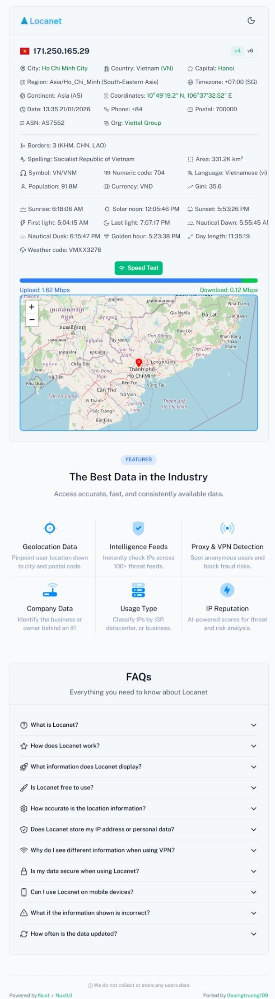

    
    
<strong>Advanced IP Geolocation & Network Information Tool</strong>

    
Detect user access location information along with IP address, featuring real-time geolocation data, interactive maps, and comprehensive network analytics.

    
    
     
    
    
    
      
    <picture>
      <source media="(prefers-color-scheme: dark)" srcset="./public/demo_dark.jpeg">
      
    </picture>

## ✨ Features

Locanet provides comprehensive network and location intelligence:

- **🔍 IP Detection**: Automatic detection of IPv4 and IPv6 addresses
- **📍 Geolocation**: Real-time location data with latitude/longitude coordinates
- **🗺️ Interactive Maps**: Visual representation using Leaflet and SVG maps
- **🌅 Sunrise/Sunset Times**: Location-based astronomical data
- **🇺🇳 Country Information**: Detailed country data and flags
- **🚀 Server-Side Rendering**: Optimized performance with Nuxt.js SSR
- **📱 Progressive Web App**: Installable PWA with offline capabilities
- **🛡️ Rate Limiting**: Built-in protection against abuse
- **🎨 Modern UI**: Beautiful interface with Nuxt UI components

## 🛠️ Technology Stack

<table>
  <thead>
    <tr>
      <th>Category</th>
      <th>Technology / Library</th>
    </tr>
  </thead>
  <tbody>
    <tr>
      <td>Framework</td>
      <td><a href="https://nuxt.com">Nuxt 4</a> (Server-Side Rendering)</td>
    </tr>
    <tr>
      <td>UI Framework</td>
      <td><a href="https://ui.nuxt.com">Nuxt UI</a> × <a href="https://icon.nuxt.com">Nuxt Icon</a></td>
    </tr>
    <tr>
      <td>State Management</td>
      <td><a href="https://pinia.esm.dev">Pinia</a> × <a href="https://pinia-colada.esm.dev">Pinia Colada</a></td>
    </tr>
    <tr>
      <td>Maps</td>
      <td><a href="https://leafletjs.com">Leaflet</a> × <a href="https://www.npmjs.com/package/svgmap">SVGMap</a></td>
    </tr>
    <tr>
      <td>Styling</td>
      <td><a href="https://tailwindcss.com">Tailwind CSS</a> × <a href="https://fonts.nuxt.com">Nuxt Fonts</a></td>
    </tr>
    <tr>
      <td>PWA</td>
      <td><a href="https://vite-pwa-org.netlify.app">Vite PWA</a></td>
    </tr>
    <tr>
      <td>Rate Limiting</td>
      <td><a href="https://github.com/animir/node-rate-limiter-flexible">Rate Limiter Flexible</a></td>
    </tr>
  </tbody>
</table>

## 📄 License

This project is licensed under the MIT License - see the [LICENSE](LICENSE) file for details.

## 🙏 Acknowledgments

- Location data powered by various IP geolocation APIs
- Map visualization using Leaflet and SVGMap
- UI components from Nuxt UI
- Icons from Iconify

## 📞 Support

- **Issues**: [GitHub Issues](https://github.com/thuongtruong109/locanet/issues)
- **Discussions**: [GitHub Discussions](https://github.com/thuongtruong109/locanet/discussions)
- **Email**: thuongtruongofficiial@gmail.com

  
Made with ❤️ by <a href="https://github.com/thuongtruong109">Tran Nguyen Thuong Truong</a>

